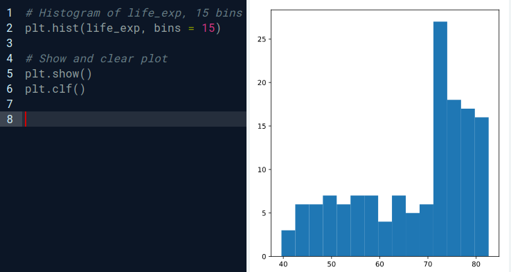
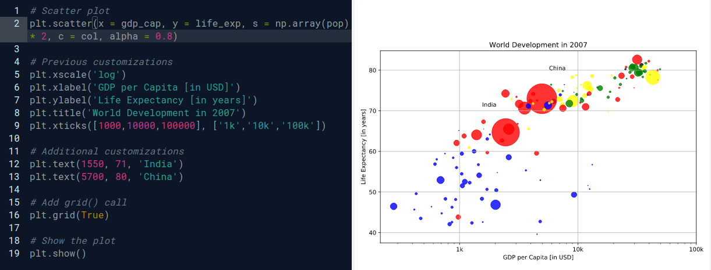

### Matplotlib
A visualização de dados é uma habilidade fundamental para aspirantes a cientistas de dados. Matplotlib facilita a criação de gráficos significativos e perspicazes. Neste capítulo, você aprenderá como construir vários tipos de gráficos e personalizá-los para serem mais atraentes visualmente e interpretáveis.

* Mudando a escala de um determinado eixo de um gráfico
    
         plt.xscale('log')

* **Histogramas**
  
  * Explorar conjunto de dados
  * Tenha uma ideia sobre distribuição
        
        #Import
        import matplotlib.pyplot as plt

        #Create histogram of life_exp data
        plt.hist(life_exp)

        #Display histogram
        plt.show()

* **Gráfico de dispersão**

        # Scatter plot
        plt.scatter(x = gdp_cap, y = life_exp, s = np.array(pop) * 2, c = col, alpha = 0.8)

        # Previous customizations
        plt.xscale('log') 
        plt.xlabel('GDP per Capita [in USD]')
        plt.ylabel('Life Expectancy [in years]')
        plt.title('World Development in 2007')
        plt.xticks([1000,10000,100000], ['1k','10k','100k'])

        # Additional customizations
        plt.text(1550, 71, 'India')
        plt.text(5700, 80, 'China')

        # Add grid() call
        plt.grid(True)

        # Show the plot
        plt.show()

### Dicionários & Pandas
Conheça o dicionário, uma alternativa à lista Python, e o pandas DataFrame, o padrão de fato para trabalhar com dados tabulares em Python. Você terá prática na criação e manipulação de conjuntos de dados e aprenderá como acessar as informações de que precisa a partir dessas estruturas de dados.
        

### Lógica, Fluxo de Controle e Filtragem

A lógica booleana é a base da tomada de decisão em programas Python. Aprenda sobre os diferentes operadores de comparação, como combiná-los com operadores booleanos e como usar os resultados booleanos em estruturas de controle. Você também aprenderá a filtrar dados no pandas DataFrames usando lógica.

### Laços de repetição
Existem várias técnicas que você pode usar para executar o código Python repetidamente. Enquanto os loops são como instruções if repetidas, o loop for itera sobre todos os tipos de estruturas de dados.

### Estudo de caso: Habilidades estatísticas

Este capítulo permitirá que você aplique todos os conceitos que aprendeu neste curso. Você usará estatística para calcular suas chances de ganhar uma aposta. Use geradores de números aleatórios, loops e Matplotlib para obter uma vantagem competitiva!