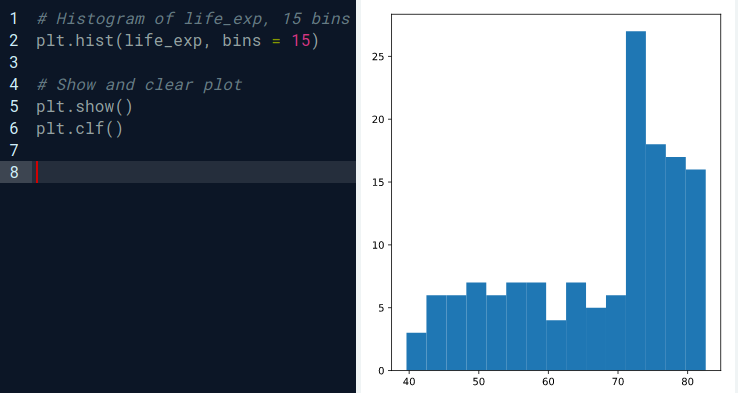
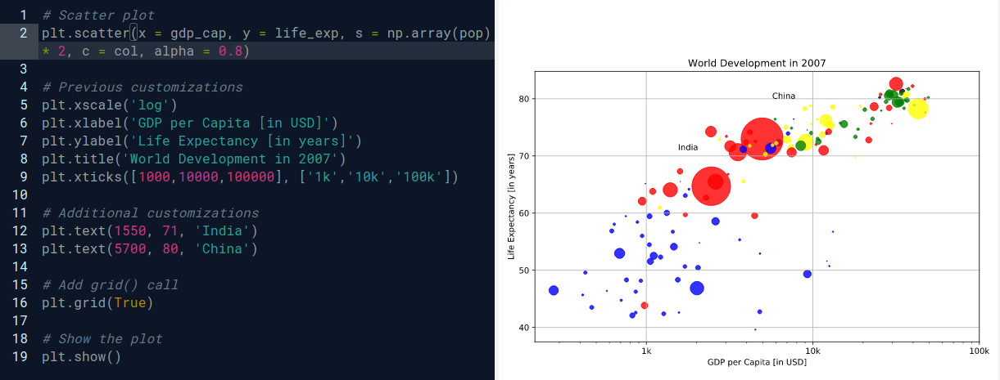

### Matplotlib
A visualização de dados é uma habilidade fundamental para aspirantes a cientistas de dados. Matplotlib facilita a criação de gráficos significativos e perspicazes. Neste capítulo, você aprenderá como construir vários tipos de gráficos e personalizá-los para serem mais atraentes visualmente e interpretáveis.

* Mudando a escala de um determinado eixo de um gráfico
    
         plt.xscale('log')


* **Histogramas**
  
  * Explorar conjunto de dados
  * Tenha uma ideia sobre distribuição
        
        #Import
        import matplotlib.pyplot as plt

        #Create histogram of life_exp data
        plt.hist(life_exp)

        #Display histogram
        plt.show()
<div align="center">

</div>

* **Gráfico de dispersão**

        # Scatter plot
        plt.scatter(x = gdp_cap, y = life_exp, s = np.array(pop) * 2, c = col, alpha = 0.8)

        # Previous customizations
        plt.xscale('log') 
        plt.xlabel('GDP per Capita [in USD]')
        plt.ylabel('Life Expectancy [in years]')
        plt.title('World Development in 2007')
        plt.xticks([1000,10000,100000], ['1k','10k','100k'])

        # Additional customizations
        plt.text(1550, 71, 'India')
        plt.text(5700, 80, 'China')

        # Add grid() call
        plt.grid(True)

        # Show the plot
        plt.show()

<div align="center">

</div>

### Dicionários & Pandas
Conheça o dicionário, uma alternativa à lista Python, e o pandas DataFrame, o padrão de fato para trabalhar com dados tabulares em Python. Você terá prática na criação e manipulação de conjuntos de dados e aprenderá como acessar as informações de que precisa a partir dessas estruturas de dados.
        
- Removendo um par chave: valor de um dicionário
        
        del world['sealand']

- **Pandas**

Pandas é uma biblioteca de código aberto que fornece estruturas de dados de alto desempenho e fáceis de usar e ferramentas de análise de dados para Python.

O DataFrame é uma das estruturas de dados mais importantes do Pandas. É basicamente uma forma de armazenar dados tabulares onde você pode rotular as linhas e colunas. Uma maneira de construir um DataFrame é a partir de um dicionário.


```python
'''nomes: contendo os nomes dos países para os quais existem dados disponíveis.
   dr: **uma** lista com booleanos que informa se as pessoas dirigem para a esquerda ou direita no país correspondente.
   cpc: o número de veículos motorizados por 1000 pessoas no país correspondente.'''

names = ['United States', 'Australia', 'Japan', 'India', 'Russia', 'Morocco', 'Egypt']
dr =  [True, False, False, False, True, True, True]
cpc = [809, 731, 588, 18, 200, 70, 45]

# Importando o pacote pandas
import pandas as pd

# Criando o dicionário my_dict, usando as listas já criadas como valores
my_dict = {
    country = names,
    drives_right = dr,
    cars_per_cap = cpc
}

# Construindo um dataframe, com o dicionário my_dict
cars = pd.DataFrame(my_dict)

# Mostrando o dataframe
print(cars)
```

- **Indexar e selecionar dados**
    * Acessando uma coluna []

        `dataframe['name_col']`

- **Loc e Iloc** (escrever...)
    
         
         

### Lógica, Fluxo de Controle e Filtragem


A lógica booleana é a base da tomada de decisão em programas Python. Aprenda sobre os diferentes operadores de comparação, como combiná-los com operadores booleanos e como usar os resultados booleanos em estruturas de controle. Você também aprenderá a filtrar dados no pandas DataFrames usando lógica.


### Laços de repetição
Existem várias técnicas que você pode usar para executar o código Python repetidamente. Enquanto os loops são como instruções if repetidas, o loop for itera sobre todos os tipos de estruturas de dados.

- **Usar um loop for** para iterar em uma lista só dá acesso a todos os elementos da lista em cada execução, um após o outro. Se você também deseja acessar as informações do índice, de modo que onde o elemento da lista que você está iterando está localizado, você pode usar enumerate().

Exemplo:


```python
fam = [1,73, 1,68, 1,71, 1,89]
para índice, altura em enumerar (fam):
     imprimir ("pessoa" + str (índice) + ":" + str (altura))

Output:
**pessoa** 0: 1.73
pessoa 1: 1.68
pessoa 2: 1.71
pessoa 3: 1.89

```

- Enumerate

```python
fam = [1.73, 1.68, 1.71, 1.89]
for index, height in enumerate(fam) :
        print("index " + str(index) + ": " + str(height))

Output:
index 0: 1.73
index 1: 1.68
index 2: 1.71
index 3: 1.89
```

- Dicionários


```python
world = { "afghanistan":30.55, "albania":2.77, "algeria":39.21 }
for key, value in world.items() :
        print(key + " -- " + str(value))

Output:
algeria -- 39.21
afghanistan -- 30.55
albania -- 2.77
```

- Dataframes


```python
import pandas as pd
brics = pd.read_csv("brics.csv", index_col = 0)
for lab, row in brics.iterrows():
        print(lab + ": " + row["capital"])

Output:
BR: Brasilia
RU: Moscow
IN: New Delhi
CH: Beijing
SA: Pretoria
```

*  Usando a função apply do Pandas
  

```python
import pandas as pd
brics = pd.read_csv("brics.csv", index_col = 0)
brics["name_length"] = brics["country"].apply(len)
print(brics)

Output:
country capital            area            population
BR Brazil Brasilia         8.516           200.40
RU Russia Moscow           17.100          143.50
IN India New Delhi         3.286           1252.00
CH China Beijing           9.597           1357.00
SA South Africa Pretoria   1.221           52.98
```

### Estudo de caso: Habilidades estatísticas

Este capítulo permitirá que você aplique todos os conceitos que aprendeu neste curso. Você usará estatística para calcular suas chances de ganhar uma aposta. Use geradores de números aleatórios, loops e Matplotlib para obter uma vantagem competitiva!
