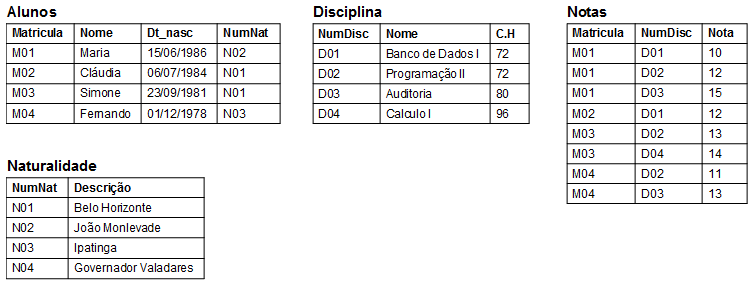

## Importando dados de diferentes tipos de dados


- **Planilhas Excel**

Quer você goste ou não, qualquer cientista de dados em trabalho precisará lidar com planilhas do Excel em algum momento. Nem sempre você vai querer fazer isso no Excel!

Aqui, você aprenderá como usar pandas para importar planilhas do Excel e como listar os nomes das planilhas em qualquer arquivo .xlsx carregado. Dado um arquivo Excel importado para uma variável spreadsheet, você pode recuperar uma lista dos nomes das planilhas usando o atributo spreadsheet.sheet_names.

Exemplo:


```python
# Import pandas
import pandas as pd

# Assign spreadsheet filename: file
file = 'battledeath.xlsx'

# Load spreadsheet: xls
xls = pd.ExcelFile(file)

# Print sheet names
print(sheet_names(xls))

Output: ['2002', '2004']
```

- **Importando dados SAS/Stata usando Pandas**

SAS: Sistema de Análise Estatística
Exemplos de utilização: análise de negócios, bioestatística;


```python
#Importando arquivos SAS
import pandas as pd
from sas7bdat import SAS7BDAT
with SAS7BDAT('file.sas7bdat') as file:         
df_sas = file.to_data_frame()
```

Stata: “Estatísticas” + “dados”

Exemplo de utilização: pesquisas acadêmicas em ciências sociais

```python
#Importando arquivos Stata
import pandas as pd
data = pd.read_stata('file1.dta')
```
## Introdução aos bancos de dados relacionais

O que são banco de dados relacionais? 

É um tipo de banco de dados baseado no modelo relacional de dados. Foi descrito pela primeira vez por Ted Codd na decada de 1960. Esse tipo de banco de dados consiste em **tabelas**. 

Uma tabela geralmente representa um tipo de entidade, como exemplo, podemos ter uma tabela de "Alunos" em um banco de dados de uma escola.

Cada **linha** da tabela representa uma instância do tipo de entidade. As **colunas** representam um atributo de cada instância.


   <div align="center">
        
   </div>