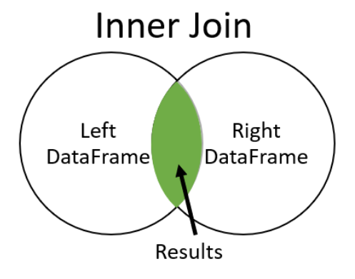

## Data Merging Basics

Uma junção interna retornará apenas as linhas correspondentes em ambas as tabelas.


<div align='center'>

</div>

- **Relação de um-para-um e um-para-muitos**

Em uma relação **um-para-um**, cada linha de uma tabela está relacionada a apenas uma linha de outra tabela.
<div align='center'>

</div>

Em uma relação **um-para-muitos**, cada linha da tabela a esquerda, está relacionada a uma ou mais linhas da tabela a direita.

<div align='center'>

</div>

- **Juntando Dataframes**

Outra operação  relacionada a DataFrames é a operação de fusão. Dois DataFrames podem conter diferentes tipos de informações sobre a mesma entidade(registro) e vinculados por algum recurso (coluna em comum). Para se juntar estas DataFrames, pandas fornece múltiplas funções, como concat(), merge(), join(), etc. Nesta seção, você irá praticar o uso merge()da função de pandas.

Você pode associar DataFrames df(que você criou concatenando df1 e df2 ao longo da linha) e df3 na coluna comum. Para fazer isso, passe os nomes dos DataFrames e um argumento adicional *on* como o nome da coluna comum, aqui id, para a merge()função:


```python
df_merge = pd.merge(df, df1, on='id')
```


O argumento *on* pode receber uma lista e isso permite usar várias colunas em comum entre os dataframes na mesclagem.

```python
ridership_cal = ridership.merge(cal, on=['year','month','day'])
```

## Merging Tables With Different Join Types

- **Left Join**

Uma junção a esquerda retorna todas as linhas de dados da tabela a esquerda e apenas as linhas da tabela a direita onde as colunas-chave correspondem.

<div align='center'>

</div>


Definir how = 'left' com o método .merge () é uma técnica útil para enriquecer ou aprimorar um conjunto de dados com informações adicionais de uma tabela diferente.


```python
# Merge the toy_story and taglines tables with a left join
toystory_tag = toy_story.merge(taglines, on= 'id', how = 'left')

# Print the rows and shape of toystory_tag
print(toystory_tag)
print(toystory_tag.shape)

Output:
     id        title        popularity         release_date             tagline
0  10193     Toy Story 3     59.995418         2010-06-16          No toy gets left behind.
1    863     Toy Story 2     73.575118         1999-10-30          The toys are back!
2    862     Toy Story       73.640445         1995-10-30                 NaN

(3, 5)
```


