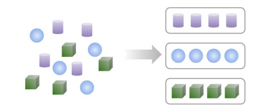
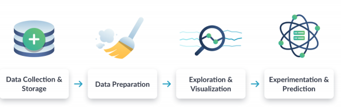

### I - Introduction to Data Science

Começaremos o curso definindo o que é ciência de dados. Abordaremos o fluxo de trabalho da ciência de dados e como a ciência de dados é aplicada a problemas do mundo real. Terminaremos o capítulo aprendendo sobre as diferentes funções no campo da ciência de dados.

 #### O que é ciência de dados?

Pode ser entendido como um conjunto de metodologias para captar milhares de formas de dados que estão disponíveis e usa-los para tirar conclusões significativas.

* Geralmente existem quatro etapas em um processo de ciência de dados

1. Coleta e armazenamento 
2. Preparação/Tratamento
3. Exploração e Visualização 
4. Experimentos e predições

|Traditional Machine Learning|Internet of things (IoT) |Deep Learning|
|---------|---------|---------|
|O que precisamos:  Uma pergunta bem definida   Um conjunto de dados de exemplo   Um novo conjunto de dados para usar nosso algoritmo|Refere-se a gadgets que não são computadores padrão| Requer muito mais dados de treinamento|

* Data science roles and tools

### II - Data Collection and Storage

* Fonte de dados: Dados Abertos e Dados de uma companhia (privados)

####  Tipos de dados
  
|Dados Quantitativos  |Dados Qualitativos |
|---------|---------|
|Podem ser contados, medidos e expressos através de números     |Descritivos e conceituais; Não podem ser medidos         |

* Armazenamento e Recuperação de dados

#### Pipeline de dados

Um pipeline de dados coloca os dados em um estágio bem definido.
  
* O ETL (extract, transform, load) é uma estrutura popular para pipelines de dados.

Exemplo de ferramenta para gerenciar pipeline: Airflow

### III - Preparation, Exploration, and Visualization

A análise exploratória de dados (EDA) é um processo promovido por John Tukey, um respeitado estatístico. Consiste em explorar os dados e formular hipóteses sobre os mesmos.

### IV - Experimentation and Prediction
- Teste A/B: utilizado para fazer um escolha entre duas opções.

A significância estatística ajuda a indicar se um resultado é devido ao acaso.

- Previsão de série temporal
 
Exemplos:

*Quanta chuva teremos no próximo mês?*

*Como o mercado de ações se moverá nas próximas seis horas?*

*Qual será a população da Terra em 20 anos?*

Os métodos de modelagem usam uma combinação de métodos estatísticos e de aprendizado de máquina;

#### Aprendizado de máquina supervisionado

* Faz uma previsão com base em dados 
* Os dados têm características e rótulos
    * Rótulo: o que queremos prever

  * Características: dados que podem prever o rótulo

O modelo treinado pode fazer previsões

#### Clusterização (Agrupamento)

* Aprendizado não supervisionado

    Utiliza dados apenas com recusos (Features);

* Divida os dados em categorias

* Casos de uso:
  * Segmentação de clientes

  * Segmentação de imagem

  * Detecção de anomalia

Etapas básicas de um projeto de ciência de dados:

